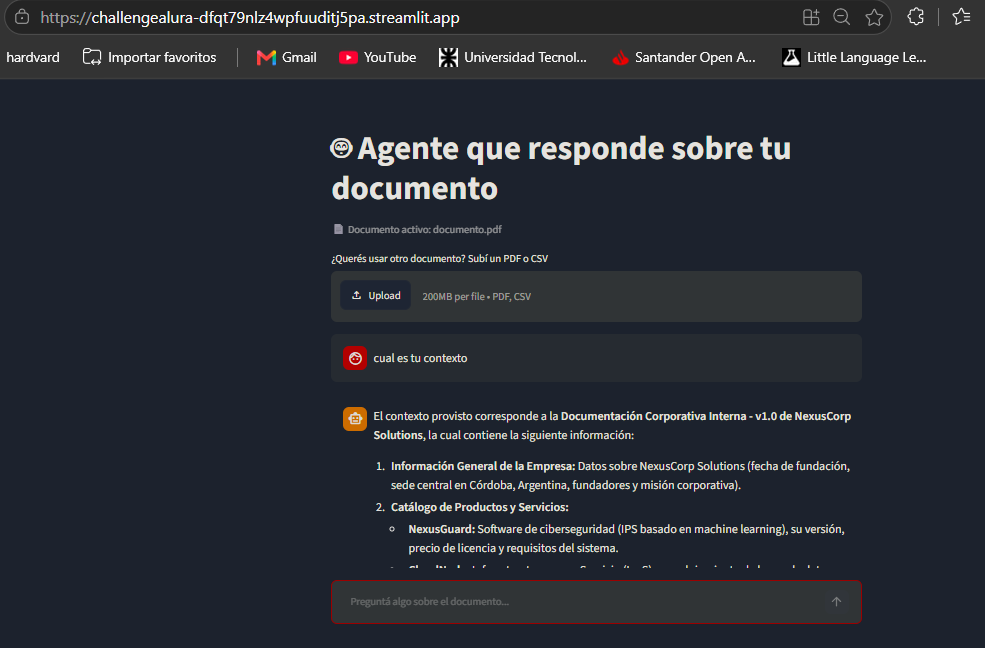

# Challenge Alura - Agente

Este es mi proyecto para el Challenge Alura: un agente que responde preguntas basándose en el contenido de un documento (PDF o CSV).

## Por qué este stack

Uso la API gratuita de Gemini en vez de correr un modelo local, para que la app sea liviana y se pueda desplegar en la nube sin depender de un servidor con mucha RAM. Para buscar la info relevante dentro del documento generé los embeddings y los guardo en un índice FAISS. LangChain conecta todas las piezas, y la interfaz la hice con Streamlit.

## Arquitectura

1. `document_loader.py` lee el PDF/CSV y lo corta en fragmentos (chunks).
2. `vector_store.py` convierte cada fragmento en un vector (embedding, vía la API de Gemini) y arma un índice FAISS para buscar rápido cuál fragmento es más relevante para una pregunta.
3. `agent.py` toma la pregunta, busca los fragmentos más relevantes en el índice, y se los pasa como contexto a Gemini para que arme la respuesta.
4. `main.py` es la versión por consola, y `app.py` es la interfaz web hecha con Streamlit.

La app carga por defecto el documento `data/documento.pdf` (documentación de una empresa ficticia, NexusCorp) apenas se abre. Si el usuario sube otro PDF o CSV desde la interfaz, ese pasa a usarse en lugar del default.

## Tecnologías

- Python
- LangChain + langchain-google-genai
- Gemini API (`gemini-flash-latest` para generar respuestas, `gemini-embedding-001` para los embeddings)
- FAISS (búsqueda vectorial)
- Streamlit (interfaz web)

## Cómo correrlo localmente

```bash
# Conseguir una API key gratis en https://aistudio.google.com/apikey
# Windows PowerShell:
$env:GOOGLE_API_KEY="tu-api-key"

py -m pip install -r requirements.txt

# Opción 1: por consola
py main.py

# Opción 2: interfaz web
py -m streamlit run app.py
```

## Ejemplos de uso

Probé el agente con un documento de ejemplo que tiene información de una empresa ficticia (políticas internas, productos, soporte técnico). Algunas preguntas y respuestas:

**Pregunta:** ¿Cuál es el SLA garantizado de CloudNode?
**Respuesta:** El SLA garantizado de CloudNode es de 99.99% de tiempo de actividad.

**Pregunta:** ¿Cuántas semanas de licencia por paternidad se otorgan?
**Respuesta:** Se otorgan 16 semanas pagas, extensibles a 20 semanas en caso de nacimientos múltiples.

**Pregunta:** ¿Qué hago si NexusGuard bloquea tráfico de IPs internas?
**Respuesta:** Acceder al panel de control de NexusGuard con credenciales de administrador, ir a Configuración de Red > Reglas de Filtrado, agregar una excepción (whitelisting) con el rango de IPs internas en notación CIDR, y reiniciar el servicio de monitoreo con `systemctl restart nexusguard-monitor`.

## Deploy

Desplegado en **Streamlit Community Cloud**, conectado directamente a este repositorio de GitHub. La API key de Gemini la configuré como "Secret" en la plataforma (no está en el código).

URL pública: https://challengealura-dfqt79nlz4wpfuuditj5pa.streamlit.app/


